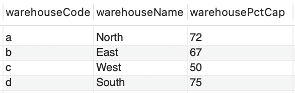
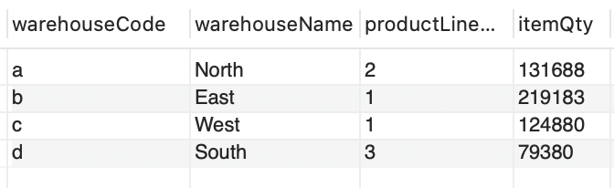
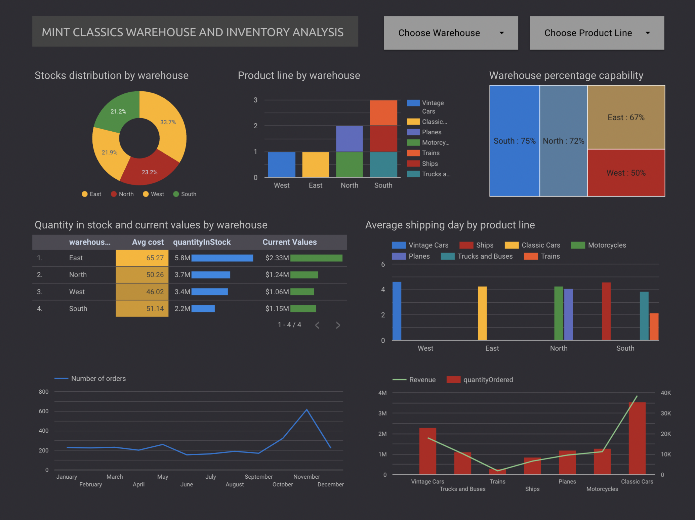
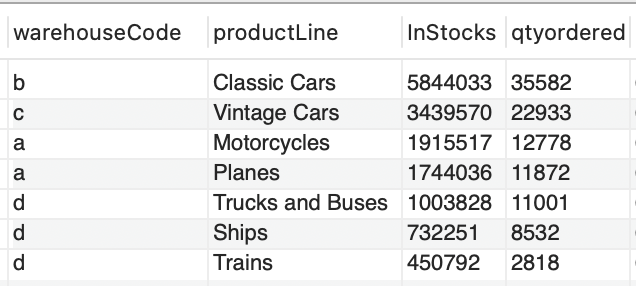
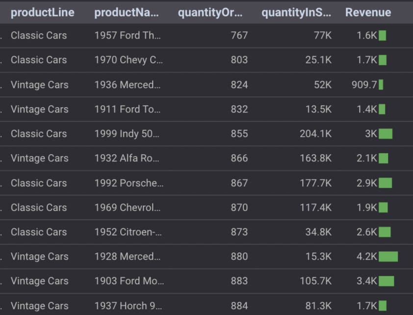
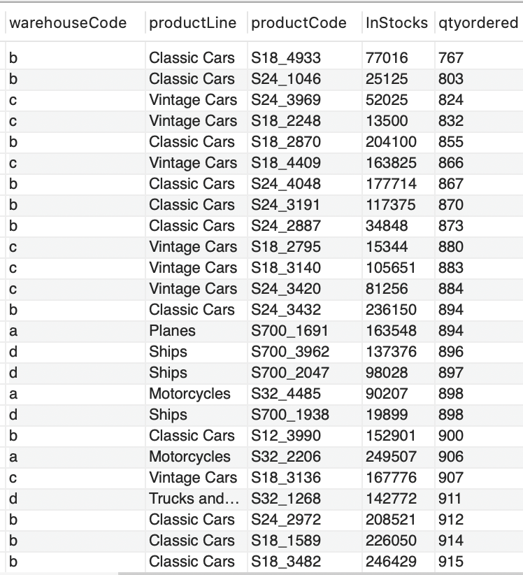

# Data Analysis - MintClassics Inventory Optimization and Warehouse Evaluation

## Overview

This analysis aims to explore the current inventory system, assess warehouse reorganization or reduction opportunities, and provide insights and recommendations based on data-driven analysis.

### Key Questions to Address:

1. **Where are items stored, and could a warehouse be eliminated if the items were rearranged?**
2. **How are inventory numbers related to sales figures? Do the inventory counts seem appropriate for each item?**
3. **Are we storing items that are not moving? Are any items candidates for being dropped from the product line?**

The answers to these questions will help formulate suggestions and recommendations for reducing inventory and potentially closing a warehouse.

## Project Objectives

1. **Explore products** currently in inventory.
2. **Identify important factors** that may influence inventory reorganization or reduction.
3. **Provide analytic insights and recommendations** for warehouse optimization and inventory management.

---

## Company Overview

The company has **7 product lines** stored in **4 warehouses**. The products are distributed across warehouses as follows:

### Warehouse Layout:
- **East Warehouse**: Holds the most stock.
- **South Warehouse**: Stores products with low movement.
- **West Warehouse**: Operates at 50% capacity, suggesting space for more stock.
- **North Warehouse**: Moderate stock levels.

- **Warehouse Capacity vs Stock Levels**:  
  

---

## Data Insights

### 1. **Warehouses and Product Lines**

The East warehouse has the most products for classic car whereas the South stored the least products, mainly for ships, trains, trucks and buses product lines.  

- **Mint Classics** has a total of **110 products**, with the majority stored in the **East Warehouse**, accounting for **39% of total stock**.

**Stock Distribution per Product Line**:  
   

### 2. **Stock vs. Sales**:

- The East Warehouse shows the highest sales and stock movements, likely due to its larger capacity.

- The **South Warehouse** shows the least movement, especially for products in the **Ships, Trains, Trucks, and Buses** product line. It stores only 23 products from this line, which suggests these products are slow-moving.

- **Average Monthly Orders per Product**:  
  The table highlights product movements across the four warehouses, showing higher activity in the **East Warehouse** and significantly lower activity in the **South Warehouse**.

- **Number of Items Ordered per Warehouse**:  
   

### 3. **Warehouse Capacity Utilization**:

- The **West Warehouse** is operating at **50% capacity**, indicating that it can potentially store more inventory, which could allow for the consolidation of stock from the **South Warehouse**.

- **Products in Inventory (Jan 2003 to May 2005)**:  
   

### 4. **Stock vs Sales Patterns**:

- There’s a **mismatch between inventory levels and sales figures** for several products. While some products are selling in large quantities (767–1808 units), their stock levels vary significantly, suggesting inefficiencies in inventory management.

- Some products have excessive stock compared to the amount being sold, leading to overstocking.

- **Stock Excess and Sales Data**:  
  

---

## Key Findings

1. **Excessive Stock**:  
   The company holds excessive stock for several products compared to the sales figures. Some products may take hundreds of years to sell with current stock levels.

2. **Underutilized Warehouses**:  
   - The **West Warehouse** is operating at only **50% capacity**. It can absorb more stock from the **South Warehouse**, which has low stock movement.
   - If the **South Warehouse** is closed, stock could be reallocated to the **West Warehouse**, optimizing space and reducing operational costs.

3. **Slow-Moving Products**:  
   - Certain product lines, especially in the **South Warehouse**, are moving at a much slower rate than expected. This suggests that they may need to be reviewed for potential discontinuation or reassignment to other warehouses.

---

## Recommendations

1. **Inventory Optimization**:  
   - Align stock levels with historical sales patterns. Reduce excessive stock in warehouses, especially in the **South Warehouse**.
   - Consider **discounting overstocks** or running marketing campaigns to clear excess inventory, particularly for slow-moving items.

2. **Warehouse Reallocation**:  
   - Given that the **West Warehouse** has 50% unused capacity, consider transferring stock from the **South Warehouse** to the **West Warehouse**. This could lead to the closure of the South warehouse and consolidation of inventory in fewer locations, reducing costs.

3. **Sales vs Stock Realignment**:  
   - **Reevaluate inventory levels** for products with low sales but high stock. These could either be discontinued or stored in lower-cost spaces until they are sold.

4. **Future Stock Planning**:  
   - Implement more **predictive inventory models** to forecast demand and avoid overstocking.
   - Consider implementing **monthly or yearly stock refill plans** based on seasonal demand and sales forecasts.

---

## Conclusion

Through this analysis, we identified significant opportunities for improving inventory management and warehouse operations. By optimizing stock levels, reallocating products between warehouses, and focusing on slow-moving items, the company can reduce costs, free up warehouse space, and potentially close underutilized storage facilities.

