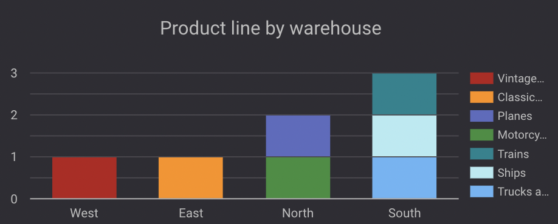
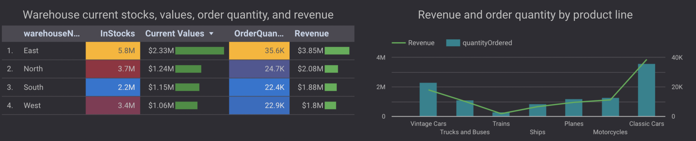

# Mint Classics Inventory and Warehouse Management

# Table of Contents
<!-- TOC -->

- [Data Structure & Initial Checks](#data-structure--initial-checks)
- [Executive Summary](#executive-summary)
- [Insights Deep Dive](#insights-deep-dive)
- [Recommendations:](#recommendations)
- [Assumptions and Caveats:](#assumptions-and-caveats)

<!-- /TOC -->

Mint Classics Company, a retailer of classic model cars and other vehicles, is looking at closing one of their storage facilities. To support a data-based business decision, they are looking for suggestions and recommendations for reorganizing or reducing inventory, while still maintaining timely service to their customers. For example, they would like to be able to ship a product to a customer within 24 hours of the order being placed.

My task is to conduct an exploratory data analysis (EDA) to investigate if there are any patterns or themes that may influence the reduction or reorganization of inventory in the Mint Classics storage facilities.

Insights and recommendations are provided on the following key areas:

- **Category 1:** Where are items stored and if they were rearranged?
- **Category 2:** How are inventory numbers related to sales figures? Do the inventory counts seem appropriate for each item?
- **Category 3:** What is the average shipping time for each product line?
- **Category 4:** Are we storing items that are not moving? Are any items candidates for being dropped from the product line?

The SQL queries for the data cheme are available here [link](./Data_Scheme.sql).

The SQL queries for exploring the data can be found here [link](./Data_Exploratory_Analysis.sql).

The SQL queries regarding various business questions can be found here [link](./Data_Analysis.sql).

An interactive Google Looker dashboard used to report and explore inventory data can be found here [link](https://lookerstudio.google.com/reporting/af75d590-c579-4f56-a0ef-7c823bff2abe).

# Data Structure & Initial Checks

The companies main database structure as seen below consists of nine tables: warehouses, products, productlines, orders, orderdetails, customers, payments, employees, offices, with a total row count of 3,868 records. A description of each table is as follows:

- __warehouses (4 records):__ Stores information about the company's warehouses, including location and capacity.
- __products (110 records):__ Contains details about the products available for sale, such as name, price, and stock.
- __productlines (7 records):__ Categorizes products into different lines or types.
- __orders (326 records):__ Stores customer orders, including order dates, status, and total amounts.
- __orderdetails (2,996 orders):__ Contains individual product details for each order, such as quantity, price, and discount.
- __customers (122 records):__  Contains customer information, such as names, contact details, and shipping addresses.
- __payments (273 records):__ Tracks customer payments, including amount, date, and payment method.
- __employees (23 people):__ Stores details about employees, including positions, hire dates, and salaries.
- __offices (7 records):__ Information about the company's offices, including location and contact details.

__Entity Relationship Diagram here__

  

  **Relationship explaination:**
  
  
  
  - ___one to one:___ each record in Entity A is related to exactly one record in Entity B, and vice versa.
  - ___one to many:___ each record in Entity A can be related to multiple records in Entity B, but each record in Entity B is related to only one record in Entity A.
  - ___many to many:___ multiple records in Entity A can be related to multiple records in Entity B.

# Executive Summary

### Overview of Findings

To optimzie warehouse and inventory mangement, we should **close the West Warehouse** due to its lowest sale volume, revenue, and current stock value among others, along with long shipping times (5 days)and it only has a single product line (vintage cars). While the South Warehouse holds slower-moving products and is less operationally efficient than the East and North, it offers flexible delivery times, stores more product lines (Trains, Ships, Trucks and Buses) than the West, and generates higher revenue. Focusing on the East and North Warehouses, which have high sales, profitability, and underutilized capacity, making them key assets for continued growth and improve operations.

  

# Insights Deep Dive

### Category 1: Where are items stored and if they were rearranged?

* **Main insight 1.** The items of each prodiucts line are arranged and stored seprately each warehouse.
    - **West Warehouse**: Vintage Cars (contribute 21.9% of current total stocks)
    - **South Warehouse**: Trains, Ship, Trucks and Buses (contribute 21.2% of current total stocks)
    - **East Warehouse**: Classic Cars (contribute 33,7% of current total stocks)
    - **North Warehouse**: Motorcycles, Planes (contribute 23.2% of current total stocks)
  
* **Main insight 2.** None of the four warehouses are operating at full capacity, with the West warehouse running at just 50%, the lowest among others.

  
  

### Category 2: How are inventory numbers related to sales figures? Do the inventory counts seem appropriate for each item?

* **Main insight 1.** The East Warehouse generated the most revenue ($3.85M), while the West Warehouse generated the least ($1.8M). The North Warehouse and South Warehouse generated $2.08M and $1.88M, respectively.
  
* **Main insight 2.** The inventory distribution is aligned with sales capacity. For example:

    - The East Warehouse holds a large inventory due to high sales volume (5.6M vs. 35.6K units sold).
    - The South Warehouse holds the least inventory due to its lower sales capacity (2.2M vs. 22.4K units sold).
  
* **Main insight 3.** There is a significant excess inventory compared to actual sales. The average sales percentage is only 0.7% of the total stock.

  

### Category 3: What is the average shipping time for each product line?

* **Main insight.** Shipping times vary between warehouses and product lines:

    - Trains: Fastest shipping time (2 days).
    -  Ships and Vintage Cars: Slowest shipping times (average 5 days).

  

### Category 4: Are we storing items that are not moving? Are any items candidates for being dropped from the product line?

* **Main insight 1.** The company offers the total of 109 products. The Classic Cars product line has the most variety (37 products), while Ships has the fewest (9 products). The Vintage Cars line consists of 24 products, and the Motorcycles, Planes, Trucks, and Buses lines have similar numbers (13, 12, and 11 products, respectively).
  
* **Main insight 2.** Both Vintage Cars and Classic Cars have a significant number of slow-moving products. These items should be considered for clearance or rearrangement to optimize stock levels.

  

# Recommendations:

Based on the insights and findings above, we would recommend the executive team to consider the following: 

* __Close the West Warehouse__: It operates at low capacity, holds a single product line, and has long delivery times.
  
* Focus on East and North Warehouses for continued operation due to their profitability and available capacity.
  
* Reorganize the South Warehouse: With 75% capacity utilization and flexible shipping times, it could serve as a consolidation point for slower-moving products.
  
* Clearance of slow-moving stock in the Vintage Cars and Classic Cars product lines is recommended to optimize storage and free up space for high-demand items.
  
* Monitor and adjust stock levels regularly based on sales trends to avoid overstocking or stockouts.

# Assumptions and Caveats:

Throughout the analysis, multiple assumptions were made to manage challenges with the data. These assumptions and caveats are noted below:

* Outliers were excluded from the analysis, particularly orders with a delivery time of 65 days or more. These outliers likely represent exceptional cases (e.g., customer issues) and could distort the overall shipping time trends and lead to misleading conclusions about operational efficiency.
  
* The data covers a period from January 2003 to May 2005 (2.5 years), which includes various seasonal fluctuations in sales and stock levels. Revenue and stock sales patterns may differ during peak or off-peak seasons, and this variability should be factored into any long-term conclusions.