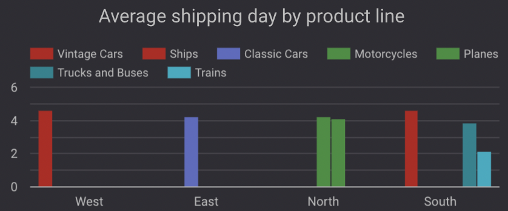

# Data Analysis - MintClassics Inventory Optimization and Warehouse Evaluation

## Overview

This analysis aims to explore the current inventory system, assess warehouse reorganization or reduction opportunities, and provide insights and recommendations based on data-driven analysis.

### Key Questions to Address:

1. **Where are items stored, and could a warehouse be eliminated if the items were rearranged?**
2. **How are inventory numbers related to sales figures? Do the inventory counts seem appropriate for each item?**
3. **Are we storing items that are not moving? Are any items candidates for being dropped from the product line?**

The answers to these questions will help formulate suggestions and recommendations for reducing inventory and potentially closing a warehouse.

## Project Objectives

1. **Explore products** currently in inventory.
2. **Identify important factors** that may influence inventory reorganization or reduction.
3. **Provide analytic insights and recommendations** for warehouse optimization and inventory management.

---

## Data scheme (ERD):

The scheme includes tables:  
- warehouses
- products
- productlines
- orders
- orderdetails
- customers
- payments
- employees

Due to the scope of this project, I only use tables: warehouses, products, orders, orderdetails for analysis.

Data scheme  

Relationship explanation :  

- ___one to one:___ each record in Entity A is related to exactly one record in Entity B, and vice versa.
- ___one to many:___ each record in Entity A can be related to multiple records in Entity B, but each record in Entity B is related to only one record in Entity A.
- ___many to many:___ multiple records in Entity A can be related to multiple records in Entity B.

---

## Data Insights
### Company Overview

The company has **7 product lines** stored in **4 warehouses**. The products are distributed across warehouses as the below table:

### Warehouse Layout:
- **East Warehouse**: has 1 product line and contribute ~ 39.48% of total stocks.
- **South Warehouse**: has 3 product lines and contribute ~ 14.3 % of total stocks.
- **West Warehouse**: has 1 product line and contribute ~ 22.5% of total stocks.
- **North Warehouse**: has 2 product line and contribute ~ 23.72% of total stocks.

**Warehouse Capacity**:  

**Stock Distribution per Product Line**:  

**The stock level and quantity sold per warehouse**:  

**The stock level and quantity sold seem to be inconsistent per product**  

**Quantity Sold by Month and Year (from Jan 2003 to May 2005)**:  

The East warehouse has the most products for classic cars, whereas the South stored the least products, mainly for ships, trains, trucks, and buses product lines.  

As inspected the total revenue for each item, the most profitable products are the classic cars, motorcycles, and planes. These items are stored in the East and North warehouses, and closing these facilities would carry significant risks for the company due to their high profitability.  

Based on the revenue contribution by each product line, we can see that Classic Cars is the most popular and most revenue-generating compared to others. The least revenue product lines are the trains, ships, trucks, and buses, all of which are located in the South warehouse. This might have less impact if we want to close this warehouse and reallocate these products to other facilities.  

__Comparing between South and West warehouses to support the closing facility decision__

I decided to look at the location that has shorter delivery time. Firstly, i want to compare only the orders that have been shipped. The below table shows the company has a total of 303 distinct orders which meet the condition.

Secondly, i inspected delivery time of these two warehouses. There is one order that the delivery day is 65 days due to customer credit issue. I decided to remove this order from the result set to avoid the bias in the data.  

The total of distinct orders now become 302 orders.   

Look at the delivery day for each product line; it is more common that Vintage Cars (the West warehouse) have the most order delivery in 4 days, whereas items in the South warehouse have delivery times varying from 2 to 5 days, which is more flexible than the warehouse in the West. 

Note: The company should also consider factors that impact on the delivery time such as labor resources, how big and complex the warehouse is for pick and pack, and the order volume.  

## Conclusion

In my opinion, we should keep the warehouses in the North and East because of the sales volume and profitability they bring. We should consider managing the stock level that is suitable for each item by predicting how many items may be sold in the next month or year to optimize storage costs and warehouse efficiency.

For the purpose of speeding up delivery times, I recommend **closing the West facility**, which currently stores the vintage car product line, and transferring the stock to the South warehouse. The South warehouse has more flexibility in shipping times, typically within 2 to 5 days, and is operating at only 50% capacity. The South warehouse offers more flexibility in shipping times, typically within 2 to 5 days, and operates at 50% capacity. Relocating inventory from the West to the South would allow for better use of storage space and improved delivery flexibility.

Additionally, implementing clearance strategies for slow-moving stock in both warehouses would help reduce transfer costs and free up space in the South warehouse for future inventory. A more detailed analysis of other relevant factors could further support and refine these recommendations.

